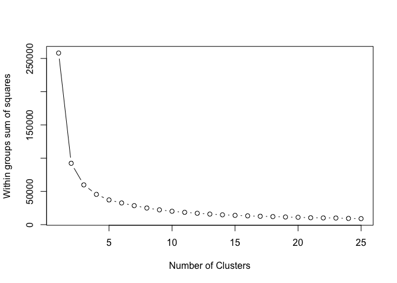

Proyecto Final - Clustering Kmeans
================
Casillas, A., González, L., Gómez, J.
Agosto 1,2020

# Clustering Kmeans

Equipo:

  - Anna Karen Casillas
  - Josue Emmnanuel Gomez
  - Luis Francisco Gonzalez

## Variables y Dependencias Iniciales

Aqui se especifican las variables generales necesarias para todo el
proyecto

``` r
#Modificar variable para especificar directorio del Proyecto Final
user.path <- "/Users/akcasill/Documents/analisisDatos/proyecto/mcc-analisisdatos-final"

local.path <- paste(user.path ,"/data",sep = "")
local.path.imgs <- paste(user.path ,"/imgs",sep = "")
```

Aqui se especifican todas las dependencias que se utilizaran en el
proyecto

``` r
#Dependencies
#install.packages("png")
#install.packages("corrplot")
#install.packages("cowplot")
#install.packages("pca")
#install.packages("factoextra")
#install.packages("FactoMineR")
library("cowplot")
```

    ## 
    ## ********************************************************

    ## Note: As of version 1.0.0, cowplot does not change the

    ##   default ggplot2 theme anymore. To recover the previous

    ##   behavior, execute:
    ##   theme_set(theme_cowplot())

    ## ********************************************************

``` r
library(png)
library(corrplot)
```

    ## corrplot 0.84 loaded

``` r
source("http://www.sthda.com/upload/rquery_cormat.r")
col<- colorRampPalette(c("blue", "white", "red"))(20)
library(FactoMineR)
library(factoextra)
```

    ## Loading required package: ggplot2

    ## Welcome! Want to learn more? See two factoextra-related books at https://goo.gl/ve3WBa

``` r
library(ggplot2)
```

Cargamos los datos integrados

``` r
setwd(local.path)
load("datos.integrados.R")
#str(datos.integrados.df)
head(datos.integrados.df,3)
```

    ##   genero admision.letras admision.numeros promedio.preparatoria edad.ingreso
    ## 1      2        60.09373         35.18746              70.28119           18
    ## 2      2        59.07874         33.15747              67.23621           17
    ## 3      2        53.14335         21.28669              60.00000           15
    ##   evalucion.socioeconomica nota.conducta beca Asist.Total prom.trab prom.exam
    ## 1                        4            16    0   0.8750000  12.47364  12.51429
    ## 2                        4            15    0   0.8567708  13.13827  13.10560
    ## 3                        4            13    0   0.8424479  12.53885  12.51326
    ##   prom.pagos uso.biblio uso.platf prom.apartado.libros cambio.carrera
    ## 1          2          2         2             1.250000              0
    ## 2          0          3         3             1.333333              0
    ## 3          0          1         1             1.083333              0

## Particion de Datos

Separamos 100 alumnos que no entraran en Kmeans.

``` r
set.seed(1234)
str(datos.integrados.df)
```

    ## 'data.frame':    1000 obs. of  16 variables:
    ##  $ genero                  : Factor w/ 2 levels "1","2": 2 2 2 1 2 2 2 2 1 2 ...
    ##  $ admision.letras         : num  60.1 59.1 53.1 57 61.5 ...
    ##  $ admision.numeros        : num  35.2 33.2 21.3 29 37.9 ...
    ##  $ promedio.preparatoria   : num  70.3 67.2 60 61 74.4 ...
    ##  $ edad.ingreso            : Factor w/ 15 levels "11","12","13",..: 8 7 5 6 8 8 5 7 4 7 ...
    ##  $ evalucion.socioeconomica: Factor w/ 4 levels "1","2","3","4": 4 4 4 4 4 4 4 4 4 4 ...
    ##  $ nota.conducta           : num  16 15 13 14 16 16 13 15 12 15 ...
    ##  $ beca                    : Factor w/ 2 levels "0","1": 1 1 1 1 1 1 1 1 1 1 ...
    ##  $ Asist.Total             : num  0.875 0.857 0.842 0.915 0.844 ...
    ##  $ prom.trab               : num  12.5 13.1 12.5 14.2 12.4 ...
    ##  $ prom.exam               : num  12.5 13.1 12.5 14.2 12.4 ...
    ##  $ prom.pagos              : num  2 0 0 2 2 0 0 2 2 2 ...
    ##  $ uso.biblio              : num  2 3 1 7 2 5 11 6 1 7 ...
    ##  $ uso.platf               : num  2 3 1 7 2 5 11 6 1 7 ...
    ##  $ prom.apartado.libros    : num  1.25 1.33 1.08 1.92 1.08 ...
    ##  $ cambio.carrera          : Factor w/ 2 levels "0","1": 1 1 1 1 1 1 1 1 1 1 ...

``` r
alumnos.gen <- sample(x=c(0,1),size=nrow(datos.integrados.df), replace=TRUE,prob = c(0.92,0.079))

#alumnos.gen
head(alumnos.gen,5)
```

    ## [1] 0 0 0 0 0

``` r
#90%
alumnos.actuales <- datos.integrados.df[alumnos.gen==0,]
nrow(alumnos.actuales)
```

    ## [1] 900

``` r
#10%
alumnos.nuevos <- datos.integrados.df[alumnos.gen==1,]
nrow(alumnos.nuevos)
```

    ## [1] 100

``` r
setwd(local.path)
save(alumnos.nuevos, file="alumnos.nuevos.R")
save(alumnos.actuales, file="alumnos.actuales.R")

#alumnos.nuevos
head(alumnos.nuevos,5)
```

    ##     genero admision.letras admision.numeros promedio.preparatoria edad.ingreso
    ## 14       2        64.93722         44.87445              84.81167           19
    ## 39       1        58.37728         31.75456              65.13184           17
    ## 81       1        62.96414         40.92828              78.89242           19
    ## 113      2        57.67933         30.35865              63.03798           17
    ## 117      2        65.19962         45.39924              85.59885           20
    ##     evalucion.socioeconomica nota.conducta beca Asist.Total prom.trab prom.exam
    ## 14                         4            17    0   0.8828125  12.36401  12.39782
    ## 39                         4            15    0   0.9296875  13.08116  13.06243
    ## 81                         2            17    1   0.7851562  12.53885  12.51326
    ## 113                        4            15    0   0.9309896  13.58561  13.59659
    ## 117                        4            18    0   0.9479167  15.08562  15.07159
    ##     prom.pagos uso.biblio uso.platf prom.apartado.libros cambio.carrera
    ## 14       2.000          2         2             1.166667              0
    ## 39       2.000          3         3             1.333333              0
    ## 81       0.000          1         1             1.083333              0
    ## 113      2.000          6         6             1.666667              0
    ## 117      1.875         10        10             2.166667              0

``` r
#Muestra de 5 alumnos.actuales
head(alumnos.actuales,5)
```

    ##   genero admision.letras admision.numeros promedio.preparatoria edad.ingreso
    ## 1      2        60.09373         35.18746              70.28119           18
    ## 2      2        59.07874         33.15747              67.23621           17
    ## 3      2        53.14335         21.28669              60.00000           15
    ## 4      1        57.00416         29.00832              61.01248           16
    ## 5      2        61.47273         37.94545              74.41818           18
    ##   evalucion.socioeconomica nota.conducta beca Asist.Total prom.trab prom.exam
    ## 1                        4            16    0   0.8750000  12.47364  12.51429
    ## 2                        4            15    0   0.8567708  13.13827  13.10560
    ## 3                        4            13    0   0.8424479  12.53885  12.51326
    ## 4                        4            14    0   0.9153646  14.21924  14.17651
    ## 5                        4            16    0   0.8437500  12.44557  12.39884
    ##   prom.pagos uso.biblio uso.platf prom.apartado.libros cambio.carrera
    ## 1          2          2         2             1.250000              0
    ## 2          0          3         3             1.333333              0
    ## 3          0          1         1             1.083333              0
    ## 4          2          7         7             1.916667              0
    ## 5          2          2         2             1.083333              0

``` r
setwd(local.path)
alumnos.nuevos$genero <- as.numeric(alumnos.nuevos$genero)
alumnos.nuevos$edad.ingreso <- as.numeric(alumnos.nuevos$edad.ingreso)
alumnos.nuevos$evalucion.socioeconomica <- as.numeric(alumnos.nuevos$evalucion.socioeconomica)
alumnos.nuevos$beca <- as.numeric(alumnos.nuevos$beca)
alumnos.nuevos$cambio.carrera <- as.numeric(alumnos.nuevos$cambio.carrera)
str(alumnos.nuevos)
```

    ## 'data.frame':    100 obs. of  16 variables:
    ##  $ genero                  : num  2 1 1 2 2 2 2 1 2 2 ...
    ##  $ admision.letras         : num  64.9 58.4 63 57.7 65.2 ...
    ##  $ admision.numeros        : num  44.9 31.8 40.9 30.4 45.4 ...
    ##  $ promedio.preparatoria   : num  84.8 65.1 78.9 63 85.6 ...
    ##  $ edad.ingreso            : num  9 7 9 7 10 7 5 10 5 10 ...
    ##  $ evalucion.socioeconomica: num  4 4 2 4 4 4 4 2 4 4 ...
    ##  $ nota.conducta           : num  17 15 17 15 18 15 13 18 13 18 ...
    ##  $ beca                    : num  1 1 2 1 1 1 1 2 1 1 ...
    ##  $ Asist.Total             : num  0.883 0.93 0.785 0.931 0.948 ...
    ##  $ prom.trab               : num  12.4 13.1 12.5 13.6 15.1 ...
    ##  $ prom.exam               : num  12.4 13.1 12.5 13.6 15.1 ...
    ##  $ prom.pagos              : num  2 2 0 2 1.88 ...
    ##  $ uso.biblio              : num  2 3 1 6 10 3 1 2 8 9 ...
    ##  $ uso.platf               : num  2 3 1 6 10 3 1 2 8 9 ...
    ##  $ prom.apartado.libros    : num  1.17 1.33 1.08 1.67 2.17 ...
    ##  $ cambio.carrera          : num  1 1 1 1 1 1 1 1 1 1 ...

``` r
save(alumnos.nuevos, file="alumnos.nuevos.R")
head(alumnos.nuevos,5)
```

    ##     genero admision.letras admision.numeros promedio.preparatoria edad.ingreso
    ## 14       2        64.93722         44.87445              84.81167            9
    ## 39       1        58.37728         31.75456              65.13184            7
    ## 81       1        62.96414         40.92828              78.89242            9
    ## 113      2        57.67933         30.35865              63.03798            7
    ## 117      2        65.19962         45.39924              85.59885           10
    ##     evalucion.socioeconomica nota.conducta beca Asist.Total prom.trab prom.exam
    ## 14                         4            17    1   0.8828125  12.36401  12.39782
    ## 39                         4            15    1   0.9296875  13.08116  13.06243
    ## 81                         2            17    2   0.7851562  12.53885  12.51326
    ## 113                        4            15    1   0.9309896  13.58561  13.59659
    ## 117                        4            18    1   0.9479167  15.08562  15.07159
    ##     prom.pagos uso.biblio uso.platf prom.apartado.libros cambio.carrera
    ## 14       2.000          2         2             1.166667              1
    ## 39       2.000          3         3             1.333333              1
    ## 81       0.000          1         1             1.083333              1
    ## 113      2.000          6         6             1.666667              1
    ## 117      1.875         10        10             2.166667              1

``` r
summary(alumnos.nuevos)
```

    ##      genero     admision.letras admision.numeros promedio.preparatoria
    ##  Min.   :1.00   Min.   :44.94   Min.   : 4.878   Min.   : 60.00       
    ##  1st Qu.:1.00   1st Qu.:57.09   1st Qu.:29.176   1st Qu.: 61.26       
    ##  Median :2.00   Median :59.94   Median :34.886   Median : 69.83       
    ##  Mean   :1.63   Mean   :59.96   Mean   :34.912   Mean   : 72.08       
    ##  3rd Qu.:2.00   3rd Qu.:63.19   3rd Qu.:41.370   3rd Qu.: 79.56       
    ##  Max.   :2.00   Max.   :72.00   Max.   :58.992   Max.   :100.00       
    ##   edad.ingreso   evalucion.socioeconomica nota.conducta        beca     
    ##  Min.   : 1.00   Min.   :1.00             Min.   : 9.00   Min.   :1.00  
    ##  1st Qu.: 6.00   1st Qu.:3.00             1st Qu.:14.00   1st Qu.:1.00  
    ##  Median : 7.00   Median :4.00             Median :15.00   Median :1.00  
    ##  Mean   : 7.44   Mean   :3.47             Mean   :15.44   Mean   :1.18  
    ##  3rd Qu.: 9.00   3rd Qu.:4.00             3rd Qu.:17.00   3rd Qu.:1.00  
    ##  Max.   :12.00   Max.   :4.00             Max.   :20.00   Max.   :2.00  
    ##   Asist.Total       prom.trab       prom.exam       prom.pagos   
    ##  Min.   :0.7578   Min.   :11.87   Min.   :11.83   Min.   :0.000  
    ##  1st Qu.:0.8779   1st Qu.:12.54   1st Qu.:12.51   1st Qu.:1.875  
    ##  Median :0.9141   Median :13.27   Median :13.24   Median :2.000  
    ##  Mean   :0.9005   Mean   :13.46   Mean   :13.43   Mean   :1.584  
    ##  3rd Qu.:0.9362   3rd Qu.:14.16   3rd Qu.:14.12   3rd Qu.:2.000  
    ##  Max.   :0.9479   Max.   :16.09   Max.   :16.09   Max.   :2.000  
    ##    uso.biblio      uso.platf     prom.apartado.libros cambio.carrera
    ##  Min.   : 0.00   Min.   : 0.00   Min.   :0.9167       Min.   :1.00  
    ##  1st Qu.: 2.00   1st Qu.: 2.00   1st Qu.:1.1667       1st Qu.:1.00  
    ##  Median : 5.00   Median : 5.00   Median :1.5000       Median :1.00  
    ##  Mean   : 5.07   Mean   : 5.07   Mean   :1.5883       Mean   :1.07  
    ##  3rd Qu.: 8.00   3rd Qu.: 8.00   3rd Qu.:1.9167       3rd Qu.:1.00  
    ##  Max.   :11.00   Max.   :11.00   Max.   :2.8333       Max.   :2.00

``` r
alumnos.actuales$genero <- as.numeric(alumnos.actuales$genero)
alumnos.actuales$edad.ingreso <- as.numeric(alumnos.actuales$edad.ingreso)
alumnos.actuales$evalucion.socioeconomica <- as.numeric(alumnos.actuales$evalucion.socioeconomica)
alumnos.actuales$beca <- as.numeric(alumnos.actuales$beca)
alumnos.actuales$cambio.carrera <- as.numeric(alumnos.actuales$cambio.carrera)
str(alumnos.actuales)
```

    ## 'data.frame':    900 obs. of  16 variables:
    ##  $ genero                  : num  2 2 2 1 2 2 2 2 1 2 ...
    ##  $ admision.letras         : num  60.1 59.1 53.1 57 61.5 ...
    ##  $ admision.numeros        : num  35.2 33.2 21.3 29 37.9 ...
    ##  $ promedio.preparatoria   : num  70.3 67.2 60 61 74.4 ...
    ##  $ edad.ingreso            : num  8 7 5 6 8 8 5 7 4 7 ...
    ##  $ evalucion.socioeconomica: num  4 4 4 4 4 4 4 4 4 4 ...
    ##  $ nota.conducta           : num  16 15 13 14 16 16 13 15 12 15 ...
    ##  $ beca                    : num  1 1 1 1 1 1 1 1 1 1 ...
    ##  $ Asist.Total             : num  0.875 0.857 0.842 0.915 0.844 ...
    ##  $ prom.trab               : num  12.5 13.1 12.5 14.2 12.4 ...
    ##  $ prom.exam               : num  12.5 13.1 12.5 14.2 12.4 ...
    ##  $ prom.pagos              : num  2 0 0 2 2 0 0 2 2 2 ...
    ##  $ uso.biblio              : num  2 3 1 7 2 5 11 6 1 7 ...
    ##  $ uso.platf               : num  2 3 1 7 2 5 11 6 1 7 ...
    ##  $ prom.apartado.libros    : num  1.25 1.33 1.08 1.92 1.08 ...
    ##  $ cambio.carrera          : num  1 1 1 1 1 1 1 1 1 1 ...

``` r
head(alumnos.actuales,5)
```

    ##   genero admision.letras admision.numeros promedio.preparatoria edad.ingreso
    ## 1      2        60.09373         35.18746              70.28119            8
    ## 2      2        59.07874         33.15747              67.23621            7
    ## 3      2        53.14335         21.28669              60.00000            5
    ## 4      1        57.00416         29.00832              61.01248            6
    ## 5      2        61.47273         37.94545              74.41818            8
    ##   evalucion.socioeconomica nota.conducta beca Asist.Total prom.trab prom.exam
    ## 1                        4            16    1   0.8750000  12.47364  12.51429
    ## 2                        4            15    1   0.8567708  13.13827  13.10560
    ## 3                        4            13    1   0.8424479  12.53885  12.51326
    ## 4                        4            14    1   0.9153646  14.21924  14.17651
    ## 5                        4            16    1   0.8437500  12.44557  12.39884
    ##   prom.pagos uso.biblio uso.platf prom.apartado.libros cambio.carrera
    ## 1          2          2         2             1.250000              1
    ## 2          0          3         3             1.333333              1
    ## 3          0          1         1             1.083333              1
    ## 4          2          7         7             1.916667              1
    ## 5          2          2         2             1.083333              1

``` r
summary(alumnos.actuales)
```

    ##      genero      admision.letras admision.numeros promedio.preparatoria
    ##  Min.   :1.000   Min.   :44.99   Min.   : 4.986   Min.   : 60.00       
    ##  1st Qu.:1.000   1st Qu.:56.60   1st Qu.:28.195   1st Qu.: 60.00       
    ##  Median :2.000   Median :60.09   Median :35.184   Median : 70.28       
    ##  Mean   :1.591   Mean   :60.07   Mean   :35.136   Mean   : 72.27       
    ##  3rd Qu.:2.000   3rd Qu.:63.67   3rd Qu.:42.335   3rd Qu.: 81.00       
    ##  Max.   :2.000   Max.   :77.71   Max.   :70.411   Max.   :100.00       
    ##   edad.ingreso    evalucion.socioeconomica nota.conducta        beca      
    ##  Min.   : 1.000   Min.   :1.000            Min.   : 9.00   Min.   :1.000  
    ##  1st Qu.: 6.000   1st Qu.:3.000            1st Qu.:14.00   1st Qu.:1.000  
    ##  Median : 8.000   Median :4.000            Median :16.00   Median :1.000  
    ##  Mean   : 7.544   Mean   :3.466            Mean   :15.54   Mean   :1.161  
    ##  3rd Qu.: 9.000   3rd Qu.:4.000            3rd Qu.:17.00   3rd Qu.:1.000  
    ##  Max.   :15.000   Max.   :4.000            Max.   :20.00   Max.   :2.000  
    ##   Asist.Total       prom.trab       prom.exam       prom.pagos   
    ##  Min.   :0.7161   Min.   :11.55   Min.   :11.54   Min.   :0.000  
    ##  1st Qu.:0.8633   1st Qu.:12.64   1st Qu.:12.60   1st Qu.:0.000  
    ##  Median :0.9095   Median :13.35   Median :13.33   Median :1.875  
    ##  Mean   :0.8960   Mean   :13.46   Mean   :13.43   Mean   :1.396  
    ##  3rd Qu.:0.9362   3rd Qu.:14.15   3rd Qu.:14.12   3rd Qu.:2.000  
    ##  Max.   :0.9479   Max.   :16.22   Max.   :16.23   Max.   :2.000  
    ##    uso.biblio       uso.platf      prom.apartado.libros cambio.carrera 
    ##  Min.   : 0.000   Min.   : 0.000   Min.   :0.8333       Min.   :1.000  
    ##  1st Qu.: 2.000   1st Qu.: 2.000   1st Qu.:1.2500       1st Qu.:1.000  
    ##  Median : 5.000   Median : 5.000   Median :1.5000       Median :1.000  
    ##  Mean   : 5.039   Mean   : 5.039   Mean   :1.5819       Mean   :1.103  
    ##  3rd Qu.: 8.000   3rd Qu.: 8.000   3rd Qu.:1.9167       3rd Qu.:1.000  
    ##  Max.   :12.000   Max.   :12.000   Max.   :2.7500       Max.   :2.000

## Analisis de Correlacion

``` r
jpeg('imgs/correlacion-alumnos-ad.jpg', width=1920, height=1080)
rquery.cormat(alumnos.actuales, type="full", col=col)
```

    ## $r
    ##                           genero evalucion.socioeconomica Asist.Total
    ## genero                    1.0000                   0.7200      0.0690
    ## evalucion.socioeconomica  0.7200                   1.0000      0.0390
    ## Asist.Total               0.0690                   0.0390      1.0000
    ## uso.biblio                0.0470                   0.0015      0.6600
    ## uso.platf                 0.0470                   0.0015      0.6600
    ## prom.apartado.libros      0.0052                  -0.0160      0.5700
    ## prom.trab                -0.0017                  -0.0230      0.5200
    ## prom.exam                -0.0012                  -0.0230      0.5300
    ## beca                     -0.5300                  -0.8900     -0.0340
    ## cambio.carrera           -0.4100                  -0.7700     -0.0042
    ## prom.pagos                0.0120                   0.0350     -0.1300
    ## promedio.preparatoria    -0.0420                  -0.0013      0.0230
    ## admision.letras          -0.0330                  -0.0073      0.0180
    ## admision.numeros         -0.0330                  -0.0073      0.0180
    ## edad.ingreso             -0.0400                  -0.0110      0.0120
    ## nota.conducta            -0.0440                  -0.0130      0.0100
    ##                          uso.biblio uso.platf prom.apartado.libros prom.trab
    ## genero                      0.04700   0.04700               0.0052  -0.00170
    ## evalucion.socioeconomica    0.00150   0.00150              -0.0160  -0.02300
    ## Asist.Total                 0.66000   0.66000               0.5700   0.52000
    ## uso.biblio                  1.00000   1.00000               0.9300   0.91000
    ## uso.platf                   1.00000   1.00000               0.9300   0.91000
    ## prom.apartado.libros        0.93000   0.93000               1.0000   0.97000
    ## prom.trab                   0.91000   0.91000               0.9700   1.00000
    ## prom.exam                   0.91000   0.91000               0.9700   1.00000
    ## beca                       -0.00550  -0.00550               0.0055   0.01200
    ## cambio.carrera              0.00860   0.00860               0.0120   0.01400
    ## prom.pagos                 -0.30000  -0.30000              -0.3000  -0.25000
    ## promedio.preparatoria       0.00094   0.00094              -0.0048   0.00280
    ## admision.letras             0.00042   0.00042              -0.0070   0.00220
    ## admision.numeros            0.00042   0.00042              -0.0070   0.00220
    ## edad.ingreso               -0.00480  -0.00480              -0.0095   0.00220
    ## nota.conducta              -0.00840  -0.00840              -0.0120  -0.00039
    ##                          prom.exam    beca cambio.carrera prom.pagos
    ## genero                    -0.00120 -0.5300        -0.4100     0.0120
    ## evalucion.socioeconomica  -0.02300 -0.8900        -0.7700     0.0350
    ## Asist.Total                0.53000 -0.0340        -0.0042    -0.1300
    ## uso.biblio                 0.91000 -0.0055         0.0086    -0.3000
    ## uso.platf                  0.91000 -0.0055         0.0086    -0.3000
    ## prom.apartado.libros       0.97000  0.0055         0.0120    -0.3000
    ## prom.trab                  1.00000  0.0120         0.0140    -0.2500
    ## prom.exam                  1.00000  0.0120         0.0140    -0.2500
    ## beca                       0.01200  1.0000         0.7700    -0.0270
    ## cambio.carrera             0.01400  0.7700         1.0000    -0.0086
    ## prom.pagos                -0.25000 -0.0270        -0.0086     1.0000
    ## promedio.preparatoria      0.00300 -0.0081        -0.0190     0.0300
    ## admision.letras            0.00200  0.0090        -0.0082     0.0480
    ## admision.numeros           0.00200  0.0090        -0.0082     0.0480
    ## edad.ingreso               0.00180  0.0110        -0.0100     0.0560
    ## nota.conducta             -0.00068  0.0130        -0.0088     0.0550
    ##                          promedio.preparatoria admision.letras admision.numeros
    ## genero                                -0.04200        -0.03300         -0.03300
    ## evalucion.socioeconomica              -0.00130        -0.00730         -0.00730
    ## Asist.Total                            0.02300         0.01800          0.01800
    ## uso.biblio                             0.00094         0.00042          0.00042
    ## uso.platf                              0.00094         0.00042          0.00042
    ## prom.apartado.libros                  -0.00480        -0.00700         -0.00700
    ## prom.trab                              0.00280         0.00220          0.00220
    ## prom.exam                              0.00300         0.00200          0.00200
    ## beca                                  -0.00810         0.00900          0.00900
    ## cambio.carrera                        -0.01900        -0.00820         -0.00820
    ## prom.pagos                             0.03000         0.04800          0.04800
    ## promedio.preparatoria                  1.00000         0.95000          0.95000
    ## admision.letras                        0.95000         1.00000          1.00000
    ## admision.numeros                       0.95000         1.00000          1.00000
    ## edad.ingreso                           0.94000         0.99000          0.99000
    ## nota.conducta                          0.94000         0.99000          0.99000
    ##                          edad.ingreso nota.conducta
    ## genero                        -0.0400      -0.04400
    ## evalucion.socioeconomica      -0.0110      -0.01300
    ## Asist.Total                    0.0120       0.01000
    ## uso.biblio                    -0.0048      -0.00840
    ## uso.platf                     -0.0048      -0.00840
    ## prom.apartado.libros          -0.0095      -0.01200
    ## prom.trab                      0.0022      -0.00039
    ## prom.exam                      0.0018      -0.00068
    ## beca                           0.0110       0.01300
    ## cambio.carrera                -0.0100      -0.00880
    ## prom.pagos                     0.0560       0.05500
    ## promedio.preparatoria          0.9400       0.94000
    ## admision.letras                0.9900       0.99000
    ## admision.numeros               0.9900       0.99000
    ## edad.ingreso                   1.0000       1.00000
    ## nota.conducta                  1.0000       1.00000
    ## 
    ## $p
    ##                            genero evalucion.socioeconomica Asist.Total
    ## genero                    0.0e+00                 2.5e-144     3.8e-02
    ## evalucion.socioeconomica 2.5e-144                  0.0e+00     2.4e-01
    ## Asist.Total               3.8e-02                  2.4e-01     0.0e+00
    ## uso.biblio                1.6e-01                  9.6e-01    2.4e-114
    ## uso.platf                 1.6e-01                  9.6e-01    2.4e-114
    ## prom.apartado.libros      8.8e-01                  6.4e-01     9.3e-79
    ## prom.trab                 9.6e-01                  4.8e-01     1.0e-64
    ## prom.exam                 9.7e-01                  5.0e-01     6.4e-65
    ## beca                      1.9e-65                 2.3e-311     3.0e-01
    ## cambio.carrera            1.9e-37                 3.9e-174     9.0e-01
    ## prom.pagos                7.1e-01                  2.9e-01     5.0e-05
    ## promedio.preparatoria     2.0e-01                  9.7e-01     4.9e-01
    ## admision.letras           3.3e-01                  8.3e-01     5.9e-01
    ## admision.numeros          3.3e-01                  8.3e-01     5.9e-01
    ## edad.ingreso              2.3e-01                  7.5e-01     7.2e-01
    ## nota.conducta             1.9e-01                  6.9e-01     7.6e-01
    ##                          uso.biblio uso.platf prom.apartado.libros prom.trab
    ## genero                      1.6e-01   1.6e-01              8.8e-01   9.6e-01
    ## evalucion.socioeconomica    9.6e-01   9.6e-01              6.4e-01   4.8e-01
    ## Asist.Total                2.4e-114  2.4e-114              9.3e-79   1.0e-64
    ## uso.biblio                  0.0e+00   0.0e+00              0.0e+00   0.0e+00
    ## uso.platf                   0.0e+00   0.0e+00              0.0e+00   0.0e+00
    ## prom.apartado.libros        0.0e+00   0.0e+00              0.0e+00   0.0e+00
    ## prom.trab                   0.0e+00   0.0e+00              0.0e+00   0.0e+00
    ## prom.exam                   0.0e+00   0.0e+00              0.0e+00   0.0e+00
    ## beca                        8.7e-01   8.7e-01              8.7e-01   7.2e-01
    ## cambio.carrera              8.0e-01   8.0e-01              7.1e-01   6.7e-01
    ## prom.pagos                  1.5e-20   1.5e-20              9.4e-20   6.7e-14
    ## promedio.preparatoria       9.8e-01   9.8e-01              8.9e-01   9.3e-01
    ## admision.letras             9.9e-01   9.9e-01              8.3e-01   9.5e-01
    ## admision.numeros            9.9e-01   9.9e-01              8.3e-01   9.5e-01
    ## edad.ingreso                8.9e-01   8.9e-01              7.8e-01   9.5e-01
    ## nota.conducta               8.0e-01   8.0e-01              7.3e-01   9.9e-01
    ##                          prom.exam     beca cambio.carrera prom.pagos
    ## genero                     9.7e-01  1.9e-65        1.9e-37    7.1e-01
    ## evalucion.socioeconomica   5.0e-01 2.3e-311       3.9e-174    2.9e-01
    ## Asist.Total                6.4e-65  3.0e-01        9.0e-01    5.0e-05
    ## uso.biblio                 0.0e+00  8.7e-01        8.0e-01    1.5e-20
    ## uso.platf                  0.0e+00  8.7e-01        8.0e-01    1.5e-20
    ## prom.apartado.libros       0.0e+00  8.7e-01        7.1e-01    9.4e-20
    ## prom.trab                  0.0e+00  7.2e-01        6.7e-01    6.7e-14
    ## prom.exam                  0.0e+00  7.2e-01        6.6e-01    2.1e-14
    ## beca                       7.2e-01  0.0e+00       6.9e-181    4.1e-01
    ## cambio.carrera             6.6e-01 6.9e-181        0.0e+00    8.0e-01
    ## prom.pagos                 2.1e-14  4.1e-01        8.0e-01    0.0e+00
    ## promedio.preparatoria      9.3e-01  8.1e-01        5.8e-01    3.6e-01
    ## admision.letras            9.5e-01  7.9e-01        8.1e-01    1.5e-01
    ## admision.numeros           9.5e-01  7.9e-01        8.1e-01    1.5e-01
    ## edad.ingreso               9.6e-01  7.5e-01        7.6e-01    9.2e-02
    ## nota.conducta              9.8e-01  7.0e-01        7.9e-01    9.7e-02
    ##                          promedio.preparatoria admision.letras admision.numeros
    ## genero                                    0.20            0.33             0.33
    ## evalucion.socioeconomica                  0.97            0.83             0.83
    ## Asist.Total                               0.49            0.59             0.59
    ## uso.biblio                                0.98            0.99             0.99
    ## uso.platf                                 0.98            0.99             0.99
    ## prom.apartado.libros                      0.89            0.83             0.83
    ## prom.trab                                 0.93            0.95             0.95
    ## prom.exam                                 0.93            0.95             0.95
    ## beca                                      0.81            0.79             0.79
    ## cambio.carrera                            0.58            0.81             0.81
    ## prom.pagos                                0.36            0.15             0.15
    ## promedio.preparatoria                     0.00            0.00             0.00
    ## admision.letras                           0.00            0.00             0.00
    ## admision.numeros                          0.00            0.00             0.00
    ## edad.ingreso                              0.00            0.00             0.00
    ## nota.conducta                             0.00            0.00             0.00
    ##                          edad.ingreso nota.conducta
    ## genero                          0.230         0.190
    ## evalucion.socioeconomica        0.750         0.690
    ## Asist.Total                     0.720         0.760
    ## uso.biblio                      0.890         0.800
    ## uso.platf                       0.890         0.800
    ## prom.apartado.libros            0.780         0.730
    ## prom.trab                       0.950         0.990
    ## prom.exam                       0.960         0.980
    ## beca                            0.750         0.700
    ## cambio.carrera                  0.760         0.790
    ## prom.pagos                      0.092         0.097
    ## promedio.preparatoria           0.000         0.000
    ## admision.letras                 0.000         0.000
    ## admision.numeros                0.000         0.000
    ## edad.ingreso                    0.000         0.000
    ## nota.conducta                   0.000         0.000
    ## 
    ## $sym
    ##                          genero evalucion.socioeconomica Asist.Total uso.biblio
    ## genero                   1                                                     
    ## evalucion.socioeconomica ,      1                                              
    ## Asist.Total                                              1                     
    ## uso.biblio                                               ,           1         
    ## uso.platf                                                ,           1         
    ## prom.apartado.libros                                     .           *         
    ## prom.trab                                                .           *         
    ## prom.exam                                                .           *         
    ## beca                     .      +                                              
    ## cambio.carrera           .      ,                                              
    ## prom.pagos                                                                     
    ## promedio.preparatoria                                                          
    ## admision.letras                                                                
    ## admision.numeros                                                               
    ## edad.ingreso                                                                   
    ## nota.conducta                                                                  
    ##                          uso.platf prom.apartado.libros prom.trab prom.exam
    ## genero                                                                     
    ## evalucion.socioeconomica                                                   
    ## Asist.Total                                                                
    ## uso.biblio                                                                 
    ## uso.platf                1                                                 
    ## prom.apartado.libros     *         1                                       
    ## prom.trab                *         B                    1                  
    ## prom.exam                *         B                    1         1        
    ## beca                                                                       
    ## cambio.carrera                                                             
    ## prom.pagos                                                                 
    ## promedio.preparatoria                                                      
    ## admision.letras                                                            
    ## admision.numeros                                                           
    ## edad.ingreso                                                               
    ## nota.conducta                                                              
    ##                          beca cambio.carrera prom.pagos promedio.preparatoria
    ## genero                                                                       
    ## evalucion.socioeconomica                                                     
    ## Asist.Total                                                                  
    ## uso.biblio                                                                   
    ## uso.platf                                                                    
    ## prom.apartado.libros                                                         
    ## prom.trab                                                                    
    ## prom.exam                                                                    
    ## beca                     1                                                   
    ## cambio.carrera           ,    1                                              
    ## prom.pagos                                   1                               
    ## promedio.preparatoria                                   1                    
    ## admision.letras                                         *                    
    ## admision.numeros                                        *                    
    ## edad.ingreso                                            *                    
    ## nota.conducta                                           *                    
    ##                          admision.letras admision.numeros edad.ingreso
    ## genero                                                                
    ## evalucion.socioeconomica                                              
    ## Asist.Total                                                           
    ## uso.biblio                                                            
    ## uso.platf                                                             
    ## prom.apartado.libros                                                  
    ## prom.trab                                                             
    ## prom.exam                                                             
    ## beca                                                                  
    ## cambio.carrera                                                        
    ## prom.pagos                                                            
    ## promedio.preparatoria                                                 
    ## admision.letras          1                                            
    ## admision.numeros         1               1                            
    ## edad.ingreso             B               B                1           
    ## nota.conducta            B               B                1           
    ##                          nota.conducta
    ## genero                                
    ## evalucion.socioeconomica              
    ## Asist.Total                           
    ## uso.biblio                            
    ## uso.platf                             
    ## prom.apartado.libros                  
    ## prom.trab                             
    ## prom.exam                             
    ## beca                                  
    ## cambio.carrera                        
    ## prom.pagos                            
    ## promedio.preparatoria                 
    ## admision.letras                       
    ## admision.numeros                      
    ## edad.ingreso                          
    ## nota.conducta            1            
    ## attr(,"legend")
    ## [1] 0 ' ' 0.3 '.' 0.6 ',' 0.8 '+' 0.9 '*' 0.95 'B' 1

``` r
dev.off()
```

    ## quartz_off_screen 
    ##                 2

``` r
cormat<-rquery.cormat(alumnos.actuales, type="full", col=col)
```

<!-- -->

correlacion con
pearson

``` r
cor.matrix <- cor(alumnos.actuales, method = "pearson", use = "complete.obs")
corrplot(cor.matrix)
```

<!-- -->

## Analisis de hombro,codo,brazo

Este analisis es para obtener cuantos centroides debemos usar

``` r
set.seed(12345)
wss.alumnos <-vector()
wss.alumnos
```

    ## logical(0)

``` r
centroides.alumnos <- 25
for ( i in 1:centroides.alumnos ) 
  wss.alumnos[i] <- kmeans(alumnos.actuales,centers = i,nstart=20)$tot.withinss
```

    ## Warning: did not converge in 10 iterations

``` r
#plot
plot(1:centroides.alumnos  , wss.alumnos , type="b", xlab = "Number of Clusters", ylab = "Within groups sum of squares")
```

<!-- -->

``` r
imgPath.codo <- paste(local.path.imgs,"/Kmeans-codo-alumnos.png",sep = "")


img.codo.alumnos <- readPNG(imgPath.codo)
plot.new()
rasterImage(img.codo.alumnos,0,0,1,1)
```

<!-- -->

``` r
set.seed(12345)
wss.alumnos <-vector()
wss.alumnos
```

    ## logical(0)

``` r
centroides.alumnos <- 10
for ( i in 1:centroides.alumnos ) 
  wss.alumnos[i] <- kmeans(alumnos.actuales,centers = i,nstart=20)$tot.withinss

#plot
plot(1:centroides.alumnos  , wss.alumnos , type="b", xlab = "Number of Clusters", ylab = "Within groups sum of squares")
```

<!-- -->

``` r
imgPath.codo.seleccionado <- paste(local.path.imgs,"/Kmeans-codo-alumnos-seleccionado.png",sep = "")


img.codo.sel.alumnos <- readPNG(imgPath.codo.seleccionado)
plot.new()
rasterImage(img.codo.sel.alumnos,0,0,1,1)
```

<!-- -->

## Kmeans - 3 Clusters

``` r
# Set seed
set.seed(12345)
# Create the k-means model: km.out
km.out <- kmeans(alumnos.actuales, centers = 3, nstart = 20)

# Inspect the result
summary(km.out)
```

    ##              Length Class  Mode   
    ## cluster      900    -none- numeric
    ## centers       48    -none- numeric
    ## totss          1    -none- numeric
    ## withinss       3    -none- numeric
    ## tot.withinss   1    -none- numeric
    ## betweenss      1    -none- numeric
    ## size           3    -none- numeric
    ## iter           1    -none- numeric
    ## ifault         1    -none- numeric

``` r
attributes(km.out)
```

    ## $names
    ## [1] "cluster"      "centers"      "totss"        "withinss"     "tot.withinss"
    ## [6] "betweenss"    "size"         "iter"         "ifault"      
    ## 
    ## $class
    ## [1] "kmeans"

``` r
km.out$size
```

    ## [1] 399 197 304

``` r
km.out$centers
```

    ##     genero admision.letras admision.numeros promedio.preparatoria edad.ingreso
    ## 1 1.596491        55.57136         26.14272              61.68544     5.759398
    ## 2 1.532995        66.70237         48.40474              89.46320    10.197970
    ## 3 1.621711        61.67078         38.34156              75.01234     8.167763
    ##   evalucion.socioeconomica nota.conducta     beca Asist.Total prom.trab
    ## 1                 3.458647      13.75940 1.165414   0.8955103  13.47159
    ## 2                 3.461929      18.15736 1.152284   0.8963687  13.45331
    ## 3                 3.476974      16.16776 1.161184   0.8964929  13.44474
    ##   prom.exam prom.pagos uso.biblio uso.platf prom.apartado.libros cambio.carrera
    ## 1  13.44729   1.378759   5.052632  5.052632             1.589599       1.112782
    ## 2  13.43161   1.440990   4.944162  4.944162             1.571912       1.106599
    ## 3  13.41817   1.390214   5.082237  5.082237             1.578399       1.088816

``` r
# Print the cluster membership component of the model
km.out$cluster
```

    ##    1    2    3    4    5    6    7    8    9   10   11   12   13   15   16   17 
    ##    3    1    1    1    3    3    1    1    1    1    2    3    1    3    3    1 
    ##   18   19   20   21   22   23   24   25   26   27   28   29   30   31   32   33 
    ##    1    2    3    1    1    1    1    1    1    1    1    3    1    1    3    2 
    ##   34   35   36   37   38   40   41   42   43   44   45   46   47   48   49   50 
    ##    3    1    1    3    1    1    2    1    1    2    1    3    3    1    1    3 
    ##   51   52   53   54   55   56   57   58   59   60   61   62   63   64   65   66 
    ##    1    1    2    2    3    3    1    3    1    3    1    1    1    3    2    2 
    ##   67   68   69   70   71   72   73   74   75   76   77   78   79   80   82   83 
    ##    3    1    3    1    3    1    1    1    1    2    1    1    1    2    1    3 
    ##   84   85   86   87   88   89   90   91   92   93   94   95   96   97   98   99 
    ##    3    3    3    3    2    1    3    1    1    3    2    3    1    1    2    3 
    ##  100  101  102  103  104  105  106  107  108  109  110  111  112  114  115  116 
    ##    2    1    3    1    3    1    3    3    1    2    2    1    2    1    2    3 
    ##  118  119  120  121  122  125  126  127  128  129  130  132  133  134  135  136 
    ##    3    2    2    1    3    3    1    3    1    1    1    3    1    1    1    1 
    ##  137  138  139  140  141  143  144  145  146  147  148  150  151  152  153  154 
    ##    3    3    3    2    1    1    2    3    2    3    3    3    1    1    2    1 
    ##  155  157  159  160  161  162  163  164  165  166  167  168  169  170  171  172 
    ##    1    3    1    1    3    1    3    1    1    1    2    1    3    1    1    1 
    ##  173  174  175  176  177  178  179  180  181  182  183  184  186  187  188  189 
    ##    3    2    1    2    3    1    2    3    3    3    1    1    2    1    3    3 
    ##  190  191  193  194  195  196  197  198  200  201  202  203  204  205  206  207 
    ##    3    3    1    1    1    1    1    1    1    2    3    2    2    1    3    2 
    ##  208  209  211  212  213  214  215  217  218  219  220  221  222  223  224  225 
    ##    1    1    3    2    1    1    3    3    1    1    1    1    1    3    1    3 
    ##  226  227  228  229  230  231  232  233  234  235  236  237  238  239  241  242 
    ##    3    3    2    3    2    1    1    1    3    3    3    1    1    1    2    3 
    ##  243  244  246  247  248  250  251  252  253  254  255  256  257  258  259  260 
    ##    2    3    3    3    1    2    2    2    1    1    1    2    1    1    1    1 
    ##  261  262  263  264  265  266  267  268  269  270  271  272  273  274  275  276 
    ##    3    3    1    3    2    3    3    1    3    1    1    1    1    3    2    2 
    ##  277  278  279  280  281  282  283  284  285  286  287  288  289  290  291  292 
    ##    1    1    3    2    3    3    1    2    3    1    3    1    3    2    3    3 
    ##  294  295  296  297  298  299  300  301  303  304  306  307  309  310  311  312 
    ##    3    3    2    2    1    1    2    2    1    3    3    1    1    1    3    2 
    ##  313  314  315  316  317  318  319  320  321  322  323  324  325  326  327  328 
    ##    2    3    1    2    2    1    2    3    2    2    2    3    1    3    1    1 
    ##  329  330  331  332  334  335  336  337  338  340  342  343  345  346  347  348 
    ##    3    3    3    3    1    3    1    3    3    3    3    1    1    2    1    3 
    ##  349  350  351  352  353  354  357  358  359  360  361  362  363  364  365  367 
    ##    2    1    1    2    1    2    2    2    3    2    2    3    1    1    1    2 
    ##  368  369  370  372  373  374  375  376  377  378  379  380  381  382  383  384 
    ##    1    2    1    3    1    1    3    2    3    1    1    3    1    1    3    1 
    ##  385  386  387  388  391  392  393  394  395  397  398  399  400  401  402  403 
    ##    1    1    1    1    1    1    3    1    3    2    2    1    2    3    2    2 
    ##  404  405  406  407  408  409  410  411  412  414  415  416  417  418  419  420 
    ##    3    1    1    1    1    2    1    3    3    2    2    1    1    1    3    1 
    ##  421  422  423  424  426  427  428  429  430  431  432  433  435  436  437  439 
    ##    3    2    1    3    1    1    2    2    2    3    2    3    1    3    2    1 
    ##  440  441  442  443  444  446  447  448  449  450  451  452  455  456  457  458 
    ##    3    2    1    2    3    1    3    2    3    1    2    1    1    1    1    3 
    ##  459  460  461  462  463  464  465  466  467  468  469  470  471  472  473  475 
    ##    2    1    1    2    3    2    3    1    2    1    2    3    1    1    2    1 
    ##  477  478  479  480  481  482  483  484  485  486  487  488  489  490  491  492 
    ##    1    2    1    2    1    1    2    2    1    1    3    1    1    3    2    1 
    ##  493  494  495  496  497  498  499  500  501  502  503  504  505  506  507  508 
    ##    2    3    1    1    2    1    1    1    2    1    3    3    3    2    2    3 
    ##  509  510  511  514  515  516  517  518  519  520  521  522  523  525  526  527 
    ##    2    2    1    3    2    2    3    3    1    3    1    3    1    1    3    2 
    ##  528  529  530  531  532  533  534  535  537  538  539  540  541  542  544  545 
    ##    1    1    2    2    3    1    1    2    2    1    1    1    1    1    2    3 
    ##  546  547  548  550  551  552  553  554  555  557  558  559  560  561  563  564 
    ##    1    3    1    1    1    1    1    3    3    2    1    2    1    1    2    3 
    ##  565  566  567  568  569  570  571  572  573  574  575  576  577  578  579  580 
    ##    1    3    2    1    3    3    2    2    2    3    1    3    2    1    1    2 
    ##  581  582  583  584  585  586  587  590  592  593  594  595  596  597  598  599 
    ##    1    1    1    1    1    3    1    3    3    3    3    2    1    3    2    3 
    ##  600  601  602  603  604  605  606  607  608  609  610  611  612  613  614  616 
    ##    2    1    3    1    3    2    1    1    1    3    1    1    2    3    1    1 
    ##  617  618  619  620  622  623  624  625  627  629  630  631  632  633  634  636 
    ##    3    1    3    3    3    1    3    1    3    1    3    1    3    3    1    1 
    ##  637  638  639  640  641  642  643  645  646  647  648  649  650  651  652  653 
    ##    1    3    1    2    2    3    1    3    1    1    3    1    1    1    2    1 
    ##  654  655  656  657  658  659  661  663  664  665  666  667  668  669  670  671 
    ##    2    2    3    3    1    3    1    1    3    3    2    1    2    1    3    3 
    ##  673  674  676  677  678  679  681  682  683  684  685  686  687  688  689  690 
    ##    3    2    1    3    2    3    3    1    2    3    3    1    3    1    2    1 
    ##  691  692  693  694  695  696  697  698  699  700  701  702  703  704  705  706 
    ##    3    1    1    1    2    1    1    3    2    3    1    1    3    3    1    1 
    ##  707  708  709  710  711  714  715  716  717  718  720  721  722  724  725  727 
    ##    3    1    1    1    1    1    3    1    1    1    2    1    1    1    1    1 
    ##  728  729  732  733  734  735  736  737  738  741  742  743  744  745  746  747 
    ##    1    3    1    3    1    1    1    1    1    1    1    1    3    2    2    3 
    ##  748  749  750  751  752  753  754  755  756  757  758  759  760  761  762  763 
    ##    2    3    3    1    3    2    1    1    1    3    2    1    2    2    3    3 
    ##  764  765  766  768  769  770  771  772  773  774  775  776  777  778  779  780 
    ##    1    2    1    3    2    1    2    1    1    1    1    3    2    2    3    3 
    ##  782  783  784  785  786  787  788  789  790  791  792  793  794  795  796  797 
    ##    3    1    3    1    3    1    1    3    3    3    1    3    3    1    1    2 
    ##  798  799  800  801  802  803  804  805  806  807  808  809  810  811  812  814 
    ##    1    3    3    1    3    3    1    3    1    1    1    2    2    3    1    3 
    ##  815  816  817  818  819  820  821  822  823  824  825  826  827  828  829  830 
    ##    3    3    3    1    1    3    3    2    1    1    3    3    1    1    3    3 
    ##  831  832  833  835  836  837  838  839  840  841  842  843  844  845  846  847 
    ##    1    3    3    2    1    2    3    1    2    1    3    3    1    3    3    1 
    ##  849  850  851  854  855  856  857  858  859  861  862  863  864  865  866  867 
    ##    1    3    1    1    2    1    1    2    3    1    2    3    2    3    3    2 
    ##  869  870  872  874  875  876  877  878  879  880  881  882  883  884  885  887 
    ##    3    3    1    1    3    1    3    1    3    1    2    3    3    2    1    1 
    ##  888  889  890  891  892  893  894  895  896  897  898  900  901  902  904  905 
    ##    2    2    2    1    1    1    3    1    2    3    1    2    3    2    2    3 
    ##  906  907  908  909  910  911  912  913  914  915  916  917  920  921  922  923 
    ##    3    1    3    3    3    3    1    1    3    1    2    2    1    3    3    2 
    ##  924  925  926  927  928  929  930  931  933  934  935  936  937  938  939  940 
    ##    1    2    3    2    2    2    3    2    2    3    1    3    3    2    2    1 
    ##  941  942  943  944  945  946  947  948  949  950  951  953  954  955  956  957 
    ##    1    2    1    3    2    3    2    1    2    3    3    1    3    2    2    3 
    ##  958  959  960  961  962  963  964  965  966  967  968  969  970  972  973  974 
    ##    1    1    1    3    1    2    1    3    1    1    3    3    3    2    1    3 
    ##  975  976  977  978  980  981  983  984  986  987  989  990  991  992  994  995 
    ##    1    1    1    1    1    3    3    3    1    3    3    3    2    3    1    1 
    ##  996  997  998 1000 
    ##    3    3    3    1

``` r
# Print the km.out object
km.out
```

    ## K-means clustering with 3 clusters of sizes 399, 197, 304
    ## 
    ## Cluster means:
    ##     genero admision.letras admision.numeros promedio.preparatoria edad.ingreso
    ## 1 1.596491        55.57136         26.14272              61.68544     5.759398
    ## 2 1.532995        66.70237         48.40474              89.46320    10.197970
    ## 3 1.621711        61.67078         38.34156              75.01234     8.167763
    ##   evalucion.socioeconomica nota.conducta     beca Asist.Total prom.trab
    ## 1                 3.458647      13.75940 1.165414   0.8955103  13.47159
    ## 2                 3.461929      18.15736 1.152284   0.8963687  13.45331
    ## 3                 3.476974      16.16776 1.161184   0.8964929  13.44474
    ##   prom.exam prom.pagos uso.biblio uso.platf prom.apartado.libros cambio.carrera
    ## 1  13.44729   1.378759   5.052632  5.052632             1.589599       1.112782
    ## 2  13.43161   1.440990   4.944162  4.944162             1.571912       1.106599
    ## 3  13.41817   1.390214   5.082237  5.082237             1.578399       1.088816
    ## 
    ## Clustering vector:
    ##    1    2    3    4    5    6    7    8    9   10   11   12   13   15   16   17 
    ##    3    1    1    1    3    3    1    1    1    1    2    3    1    3    3    1 
    ##   18   19   20   21   22   23   24   25   26   27   28   29   30   31   32   33 
    ##    1    2    3    1    1    1    1    1    1    1    1    3    1    1    3    2 
    ##   34   35   36   37   38   40   41   42   43   44   45   46   47   48   49   50 
    ##    3    1    1    3    1    1    2    1    1    2    1    3    3    1    1    3 
    ##   51   52   53   54   55   56   57   58   59   60   61   62   63   64   65   66 
    ##    1    1    2    2    3    3    1    3    1    3    1    1    1    3    2    2 
    ##   67   68   69   70   71   72   73   74   75   76   77   78   79   80   82   83 
    ##    3    1    3    1    3    1    1    1    1    2    1    1    1    2    1    3 
    ##   84   85   86   87   88   89   90   91   92   93   94   95   96   97   98   99 
    ##    3    3    3    3    2    1    3    1    1    3    2    3    1    1    2    3 
    ##  100  101  102  103  104  105  106  107  108  109  110  111  112  114  115  116 
    ##    2    1    3    1    3    1    3    3    1    2    2    1    2    1    2    3 
    ##  118  119  120  121  122  125  126  127  128  129  130  132  133  134  135  136 
    ##    3    2    2    1    3    3    1    3    1    1    1    3    1    1    1    1 
    ##  137  138  139  140  141  143  144  145  146  147  148  150  151  152  153  154 
    ##    3    3    3    2    1    1    2    3    2    3    3    3    1    1    2    1 
    ##  155  157  159  160  161  162  163  164  165  166  167  168  169  170  171  172 
    ##    1    3    1    1    3    1    3    1    1    1    2    1    3    1    1    1 
    ##  173  174  175  176  177  178  179  180  181  182  183  184  186  187  188  189 
    ##    3    2    1    2    3    1    2    3    3    3    1    1    2    1    3    3 
    ##  190  191  193  194  195  196  197  198  200  201  202  203  204  205  206  207 
    ##    3    3    1    1    1    1    1    1    1    2    3    2    2    1    3    2 
    ##  208  209  211  212  213  214  215  217  218  219  220  221  222  223  224  225 
    ##    1    1    3    2    1    1    3    3    1    1    1    1    1    3    1    3 
    ##  226  227  228  229  230  231  232  233  234  235  236  237  238  239  241  242 
    ##    3    3    2    3    2    1    1    1    3    3    3    1    1    1    2    3 
    ##  243  244  246  247  248  250  251  252  253  254  255  256  257  258  259  260 
    ##    2    3    3    3    1    2    2    2    1    1    1    2    1    1    1    1 
    ##  261  262  263  264  265  266  267  268  269  270  271  272  273  274  275  276 
    ##    3    3    1    3    2    3    3    1    3    1    1    1    1    3    2    2 
    ##  277  278  279  280  281  282  283  284  285  286  287  288  289  290  291  292 
    ##    1    1    3    2    3    3    1    2    3    1    3    1    3    2    3    3 
    ##  294  295  296  297  298  299  300  301  303  304  306  307  309  310  311  312 
    ##    3    3    2    2    1    1    2    2    1    3    3    1    1    1    3    2 
    ##  313  314  315  316  317  318  319  320  321  322  323  324  325  326  327  328 
    ##    2    3    1    2    2    1    2    3    2    2    2    3    1    3    1    1 
    ##  329  330  331  332  334  335  336  337  338  340  342  343  345  346  347  348 
    ##    3    3    3    3    1    3    1    3    3    3    3    1    1    2    1    3 
    ##  349  350  351  352  353  354  357  358  359  360  361  362  363  364  365  367 
    ##    2    1    1    2    1    2    2    2    3    2    2    3    1    1    1    2 
    ##  368  369  370  372  373  374  375  376  377  378  379  380  381  382  383  384 
    ##    1    2    1    3    1    1    3    2    3    1    1    3    1    1    3    1 
    ##  385  386  387  388  391  392  393  394  395  397  398  399  400  401  402  403 
    ##    1    1    1    1    1    1    3    1    3    2    2    1    2    3    2    2 
    ##  404  405  406  407  408  409  410  411  412  414  415  416  417  418  419  420 
    ##    3    1    1    1    1    2    1    3    3    2    2    1    1    1    3    1 
    ##  421  422  423  424  426  427  428  429  430  431  432  433  435  436  437  439 
    ##    3    2    1    3    1    1    2    2    2    3    2    3    1    3    2    1 
    ##  440  441  442  443  444  446  447  448  449  450  451  452  455  456  457  458 
    ##    3    2    1    2    3    1    3    2    3    1    2    1    1    1    1    3 
    ##  459  460  461  462  463  464  465  466  467  468  469  470  471  472  473  475 
    ##    2    1    1    2    3    2    3    1    2    1    2    3    1    1    2    1 
    ##  477  478  479  480  481  482  483  484  485  486  487  488  489  490  491  492 
    ##    1    2    1    2    1    1    2    2    1    1    3    1    1    3    2    1 
    ##  493  494  495  496  497  498  499  500  501  502  503  504  505  506  507  508 
    ##    2    3    1    1    2    1    1    1    2    1    3    3    3    2    2    3 
    ##  509  510  511  514  515  516  517  518  519  520  521  522  523  525  526  527 
    ##    2    2    1    3    2    2    3    3    1    3    1    3    1    1    3    2 
    ##  528  529  530  531  532  533  534  535  537  538  539  540  541  542  544  545 
    ##    1    1    2    2    3    1    1    2    2    1    1    1    1    1    2    3 
    ##  546  547  548  550  551  552  553  554  555  557  558  559  560  561  563  564 
    ##    1    3    1    1    1    1    1    3    3    2    1    2    1    1    2    3 
    ##  565  566  567  568  569  570  571  572  573  574  575  576  577  578  579  580 
    ##    1    3    2    1    3    3    2    2    2    3    1    3    2    1    1    2 
    ##  581  582  583  584  585  586  587  590  592  593  594  595  596  597  598  599 
    ##    1    1    1    1    1    3    1    3    3    3    3    2    1    3    2    3 
    ##  600  601  602  603  604  605  606  607  608  609  610  611  612  613  614  616 
    ##    2    1    3    1    3    2    1    1    1    3    1    1    2    3    1    1 
    ##  617  618  619  620  622  623  624  625  627  629  630  631  632  633  634  636 
    ##    3    1    3    3    3    1    3    1    3    1    3    1    3    3    1    1 
    ##  637  638  639  640  641  642  643  645  646  647  648  649  650  651  652  653 
    ##    1    3    1    2    2    3    1    3    1    1    3    1    1    1    2    1 
    ##  654  655  656  657  658  659  661  663  664  665  666  667  668  669  670  671 
    ##    2    2    3    3    1    3    1    1    3    3    2    1    2    1    3    3 
    ##  673  674  676  677  678  679  681  682  683  684  685  686  687  688  689  690 
    ##    3    2    1    3    2    3    3    1    2    3    3    1    3    1    2    1 
    ##  691  692  693  694  695  696  697  698  699  700  701  702  703  704  705  706 
    ##    3    1    1    1    2    1    1    3    2    3    1    1    3    3    1    1 
    ##  707  708  709  710  711  714  715  716  717  718  720  721  722  724  725  727 
    ##    3    1    1    1    1    1    3    1    1    1    2    1    1    1    1    1 
    ##  728  729  732  733  734  735  736  737  738  741  742  743  744  745  746  747 
    ##    1    3    1    3    1    1    1    1    1    1    1    1    3    2    2    3 
    ##  748  749  750  751  752  753  754  755  756  757  758  759  760  761  762  763 
    ##    2    3    3    1    3    2    1    1    1    3    2    1    2    2    3    3 
    ##  764  765  766  768  769  770  771  772  773  774  775  776  777  778  779  780 
    ##    1    2    1    3    2    1    2    1    1    1    1    3    2    2    3    3 
    ##  782  783  784  785  786  787  788  789  790  791  792  793  794  795  796  797 
    ##    3    1    3    1    3    1    1    3    3    3    1    3    3    1    1    2 
    ##  798  799  800  801  802  803  804  805  806  807  808  809  810  811  812  814 
    ##    1    3    3    1    3    3    1    3    1    1    1    2    2    3    1    3 
    ##  815  816  817  818  819  820  821  822  823  824  825  826  827  828  829  830 
    ##    3    3    3    1    1    3    3    2    1    1    3    3    1    1    3    3 
    ##  831  832  833  835  836  837  838  839  840  841  842  843  844  845  846  847 
    ##    1    3    3    2    1    2    3    1    2    1    3    3    1    3    3    1 
    ##  849  850  851  854  855  856  857  858  859  861  862  863  864  865  866  867 
    ##    1    3    1    1    2    1    1    2    3    1    2    3    2    3    3    2 
    ##  869  870  872  874  875  876  877  878  879  880  881  882  883  884  885  887 
    ##    3    3    1    1    3    1    3    1    3    1    2    3    3    2    1    1 
    ##  888  889  890  891  892  893  894  895  896  897  898  900  901  902  904  905 
    ##    2    2    2    1    1    1    3    1    2    3    1    2    3    2    2    3 
    ##  906  907  908  909  910  911  912  913  914  915  916  917  920  921  922  923 
    ##    3    1    3    3    3    3    1    1    3    1    2    2    1    3    3    2 
    ##  924  925  926  927  928  929  930  931  933  934  935  936  937  938  939  940 
    ##    1    2    3    2    2    2    3    2    2    3    1    3    3    2    2    1 
    ##  941  942  943  944  945  946  947  948  949  950  951  953  954  955  956  957 
    ##    1    2    1    3    2    3    2    1    2    3    3    1    3    2    2    3 
    ##  958  959  960  961  962  963  964  965  966  967  968  969  970  972  973  974 
    ##    1    1    1    3    1    2    1    3    1    1    3    3    3    2    1    3 
    ##  975  976  977  978  980  981  983  984  986  987  989  990  991  992  994  995 
    ##    1    1    1    1    1    3    3    3    1    3    3    3    2    3    1    1 
    ##  996  997  998 1000 
    ##    3    3    3    1 
    ## 
    ## Within cluster sum of squares by cluster:
    ## [1] 28036.41 16111.21 15672.11
    ##  (between_SS / total_SS =  76.8 %)
    ## 
    ## Available components:
    ## 
    ## [1] "cluster"      "centers"      "totss"        "withinss"     "tot.withinss"
    ## [6] "betweenss"    "size"         "iter"         "ifault"

``` r
km.out$cluster
```

    ##    1    2    3    4    5    6    7    8    9   10   11   12   13   15   16   17 
    ##    3    1    1    1    3    3    1    1    1    1    2    3    1    3    3    1 
    ##   18   19   20   21   22   23   24   25   26   27   28   29   30   31   32   33 
    ##    1    2    3    1    1    1    1    1    1    1    1    3    1    1    3    2 
    ##   34   35   36   37   38   40   41   42   43   44   45   46   47   48   49   50 
    ##    3    1    1    3    1    1    2    1    1    2    1    3    3    1    1    3 
    ##   51   52   53   54   55   56   57   58   59   60   61   62   63   64   65   66 
    ##    1    1    2    2    3    3    1    3    1    3    1    1    1    3    2    2 
    ##   67   68   69   70   71   72   73   74   75   76   77   78   79   80   82   83 
    ##    3    1    3    1    3    1    1    1    1    2    1    1    1    2    1    3 
    ##   84   85   86   87   88   89   90   91   92   93   94   95   96   97   98   99 
    ##    3    3    3    3    2    1    3    1    1    3    2    3    1    1    2    3 
    ##  100  101  102  103  104  105  106  107  108  109  110  111  112  114  115  116 
    ##    2    1    3    1    3    1    3    3    1    2    2    1    2    1    2    3 
    ##  118  119  120  121  122  125  126  127  128  129  130  132  133  134  135  136 
    ##    3    2    2    1    3    3    1    3    1    1    1    3    1    1    1    1 
    ##  137  138  139  140  141  143  144  145  146  147  148  150  151  152  153  154 
    ##    3    3    3    2    1    1    2    3    2    3    3    3    1    1    2    1 
    ##  155  157  159  160  161  162  163  164  165  166  167  168  169  170  171  172 
    ##    1    3    1    1    3    1    3    1    1    1    2    1    3    1    1    1 
    ##  173  174  175  176  177  178  179  180  181  182  183  184  186  187  188  189 
    ##    3    2    1    2    3    1    2    3    3    3    1    1    2    1    3    3 
    ##  190  191  193  194  195  196  197  198  200  201  202  203  204  205  206  207 
    ##    3    3    1    1    1    1    1    1    1    2    3    2    2    1    3    2 
    ##  208  209  211  212  213  214  215  217  218  219  220  221  222  223  224  225 
    ##    1    1    3    2    1    1    3    3    1    1    1    1    1    3    1    3 
    ##  226  227  228  229  230  231  232  233  234  235  236  237  238  239  241  242 
    ##    3    3    2    3    2    1    1    1    3    3    3    1    1    1    2    3 
    ##  243  244  246  247  248  250  251  252  253  254  255  256  257  258  259  260 
    ##    2    3    3    3    1    2    2    2    1    1    1    2    1    1    1    1 
    ##  261  262  263  264  265  266  267  268  269  270  271  272  273  274  275  276 
    ##    3    3    1    3    2    3    3    1    3    1    1    1    1    3    2    2 
    ##  277  278  279  280  281  282  283  284  285  286  287  288  289  290  291  292 
    ##    1    1    3    2    3    3    1    2    3    1    3    1    3    2    3    3 
    ##  294  295  296  297  298  299  300  301  303  304  306  307  309  310  311  312 
    ##    3    3    2    2    1    1    2    2    1    3    3    1    1    1    3    2 
    ##  313  314  315  316  317  318  319  320  321  322  323  324  325  326  327  328 
    ##    2    3    1    2    2    1    2    3    2    2    2    3    1    3    1    1 
    ##  329  330  331  332  334  335  336  337  338  340  342  343  345  346  347  348 
    ##    3    3    3    3    1    3    1    3    3    3    3    1    1    2    1    3 
    ##  349  350  351  352  353  354  357  358  359  360  361  362  363  364  365  367 
    ##    2    1    1    2    1    2    2    2    3    2    2    3    1    1    1    2 
    ##  368  369  370  372  373  374  375  376  377  378  379  380  381  382  383  384 
    ##    1    2    1    3    1    1    3    2    3    1    1    3    1    1    3    1 
    ##  385  386  387  388  391  392  393  394  395  397  398  399  400  401  402  403 
    ##    1    1    1    1    1    1    3    1    3    2    2    1    2    3    2    2 
    ##  404  405  406  407  408  409  410  411  412  414  415  416  417  418  419  420 
    ##    3    1    1    1    1    2    1    3    3    2    2    1    1    1    3    1 
    ##  421  422  423  424  426  427  428  429  430  431  432  433  435  436  437  439 
    ##    3    2    1    3    1    1    2    2    2    3    2    3    1    3    2    1 
    ##  440  441  442  443  444  446  447  448  449  450  451  452  455  456  457  458 
    ##    3    2    1    2    3    1    3    2    3    1    2    1    1    1    1    3 
    ##  459  460  461  462  463  464  465  466  467  468  469  470  471  472  473  475 
    ##    2    1    1    2    3    2    3    1    2    1    2    3    1    1    2    1 
    ##  477  478  479  480  481  482  483  484  485  486  487  488  489  490  491  492 
    ##    1    2    1    2    1    1    2    2    1    1    3    1    1    3    2    1 
    ##  493  494  495  496  497  498  499  500  501  502  503  504  505  506  507  508 
    ##    2    3    1    1    2    1    1    1    2    1    3    3    3    2    2    3 
    ##  509  510  511  514  515  516  517  518  519  520  521  522  523  525  526  527 
    ##    2    2    1    3    2    2    3    3    1    3    1    3    1    1    3    2 
    ##  528  529  530  531  532  533  534  535  537  538  539  540  541  542  544  545 
    ##    1    1    2    2    3    1    1    2    2    1    1    1    1    1    2    3 
    ##  546  547  548  550  551  552  553  554  555  557  558  559  560  561  563  564 
    ##    1    3    1    1    1    1    1    3    3    2    1    2    1    1    2    3 
    ##  565  566  567  568  569  570  571  572  573  574  575  576  577  578  579  580 
    ##    1    3    2    1    3    3    2    2    2    3    1    3    2    1    1    2 
    ##  581  582  583  584  585  586  587  590  592  593  594  595  596  597  598  599 
    ##    1    1    1    1    1    3    1    3    3    3    3    2    1    3    2    3 
    ##  600  601  602  603  604  605  606  607  608  609  610  611  612  613  614  616 
    ##    2    1    3    1    3    2    1    1    1    3    1    1    2    3    1    1 
    ##  617  618  619  620  622  623  624  625  627  629  630  631  632  633  634  636 
    ##    3    1    3    3    3    1    3    1    3    1    3    1    3    3    1    1 
    ##  637  638  639  640  641  642  643  645  646  647  648  649  650  651  652  653 
    ##    1    3    1    2    2    3    1    3    1    1    3    1    1    1    2    1 
    ##  654  655  656  657  658  659  661  663  664  665  666  667  668  669  670  671 
    ##    2    2    3    3    1    3    1    1    3    3    2    1    2    1    3    3 
    ##  673  674  676  677  678  679  681  682  683  684  685  686  687  688  689  690 
    ##    3    2    1    3    2    3    3    1    2    3    3    1    3    1    2    1 
    ##  691  692  693  694  695  696  697  698  699  700  701  702  703  704  705  706 
    ##    3    1    1    1    2    1    1    3    2    3    1    1    3    3    1    1 
    ##  707  708  709  710  711  714  715  716  717  718  720  721  722  724  725  727 
    ##    3    1    1    1    1    1    3    1    1    1    2    1    1    1    1    1 
    ##  728  729  732  733  734  735  736  737  738  741  742  743  744  745  746  747 
    ##    1    3    1    3    1    1    1    1    1    1    1    1    3    2    2    3 
    ##  748  749  750  751  752  753  754  755  756  757  758  759  760  761  762  763 
    ##    2    3    3    1    3    2    1    1    1    3    2    1    2    2    3    3 
    ##  764  765  766  768  769  770  771  772  773  774  775  776  777  778  779  780 
    ##    1    2    1    3    2    1    2    1    1    1    1    3    2    2    3    3 
    ##  782  783  784  785  786  787  788  789  790  791  792  793  794  795  796  797 
    ##    3    1    3    1    3    1    1    3    3    3    1    3    3    1    1    2 
    ##  798  799  800  801  802  803  804  805  806  807  808  809  810  811  812  814 
    ##    1    3    3    1    3    3    1    3    1    1    1    2    2    3    1    3 
    ##  815  816  817  818  819  820  821  822  823  824  825  826  827  828  829  830 
    ##    3    3    3    1    1    3    3    2    1    1    3    3    1    1    3    3 
    ##  831  832  833  835  836  837  838  839  840  841  842  843  844  845  846  847 
    ##    1    3    3    2    1    2    3    1    2    1    3    3    1    3    3    1 
    ##  849  850  851  854  855  856  857  858  859  861  862  863  864  865  866  867 
    ##    1    3    1    1    2    1    1    2    3    1    2    3    2    3    3    2 
    ##  869  870  872  874  875  876  877  878  879  880  881  882  883  884  885  887 
    ##    3    3    1    1    3    1    3    1    3    1    2    3    3    2    1    1 
    ##  888  889  890  891  892  893  894  895  896  897  898  900  901  902  904  905 
    ##    2    2    2    1    1    1    3    1    2    3    1    2    3    2    2    3 
    ##  906  907  908  909  910  911  912  913  914  915  916  917  920  921  922  923 
    ##    3    1    3    3    3    3    1    1    3    1    2    2    1    3    3    2 
    ##  924  925  926  927  928  929  930  931  933  934  935  936  937  938  939  940 
    ##    1    2    3    2    2    2    3    2    2    3    1    3    3    2    2    1 
    ##  941  942  943  944  945  946  947  948  949  950  951  953  954  955  956  957 
    ##    1    2    1    3    2    3    2    1    2    3    3    1    3    2    2    3 
    ##  958  959  960  961  962  963  964  965  966  967  968  969  970  972  973  974 
    ##    1    1    1    3    1    2    1    3    1    1    3    3    3    2    1    3 
    ##  975  976  977  978  980  981  983  984  986  987  989  990  991  992  994  995 
    ##    1    1    1    1    1    3    3    3    1    3    3    3    2    3    1    1 
    ##  996  997  998 1000 
    ##    3    3    3    1

Agregar Columna para identificar Grupo en Riesgo *Grupo De Riesgo
Seleccionado 3*

``` r
desercion <- vector(mode="numeric", length = nrow(alumnos.actuales))
alumnos.actuales <- cbind(alumnos.actuales, desercion)
alumnos.actuales[km.out$cluster==3,]$desercion <- 1

str(alumnos.actuales)
```

    ## 'data.frame':    900 obs. of  17 variables:
    ##  $ genero                  : num  2 2 2 1 2 2 2 2 1 2 ...
    ##  $ admision.letras         : num  60.1 59.1 53.1 57 61.5 ...
    ##  $ admision.numeros        : num  35.2 33.2 21.3 29 37.9 ...
    ##  $ promedio.preparatoria   : num  70.3 67.2 60 61 74.4 ...
    ##  $ edad.ingreso            : num  8 7 5 6 8 8 5 7 4 7 ...
    ##  $ evalucion.socioeconomica: num  4 4 4 4 4 4 4 4 4 4 ...
    ##  $ nota.conducta           : num  16 15 13 14 16 16 13 15 12 15 ...
    ##  $ beca                    : num  1 1 1 1 1 1 1 1 1 1 ...
    ##  $ Asist.Total             : num  0.875 0.857 0.842 0.915 0.844 ...
    ##  $ prom.trab               : num  12.5 13.1 12.5 14.2 12.4 ...
    ##  $ prom.exam               : num  12.5 13.1 12.5 14.2 12.4 ...
    ##  $ prom.pagos              : num  2 0 0 2 2 0 0 2 2 2 ...
    ##  $ uso.biblio              : num  2 3 1 7 2 5 11 6 1 7 ...
    ##  $ uso.platf               : num  2 3 1 7 2 5 11 6 1 7 ...
    ##  $ prom.apartado.libros    : num  1.25 1.33 1.08 1.92 1.08 ...
    ##  $ cambio.carrera          : num  1 1 1 1 1 1 1 1 1 1 ...
    ##  $ desercion               : num  1 0 0 0 1 1 0 0 0 0 ...

``` r
head(alumnos.actuales,5)
```

    ##   genero admision.letras admision.numeros promedio.preparatoria edad.ingreso
    ## 1      2        60.09373         35.18746              70.28119            8
    ## 2      2        59.07874         33.15747              67.23621            7
    ## 3      2        53.14335         21.28669              60.00000            5
    ## 4      1        57.00416         29.00832              61.01248            6
    ## 5      2        61.47273         37.94545              74.41818            8
    ##   evalucion.socioeconomica nota.conducta beca Asist.Total prom.trab prom.exam
    ## 1                        4            16    1   0.8750000  12.47364  12.51429
    ## 2                        4            15    1   0.8567708  13.13827  13.10560
    ## 3                        4            13    1   0.8424479  12.53885  12.51326
    ## 4                        4            14    1   0.9153646  14.21924  14.17651
    ## 5                        4            16    1   0.8437500  12.44557  12.39884
    ##   prom.pagos uso.biblio uso.platf prom.apartado.libros cambio.carrera desercion
    ## 1          2          2         2             1.250000              1         1
    ## 2          0          3         3             1.333333              1         0
    ## 3          0          1         1             1.083333              1         0
    ## 4          2          7         7             1.916667              1         0
    ## 5          2          2         2             1.083333              1         1

## PCA

``` r
res.pca <- PCA(alumnos.actuales, graph = FALSE)
fviz_screeplot(res.pca, addlabels = TRUE, ylim = c (0, 50))
```

<!-- -->

``` r
# Extraer los resultados por variables.
var <- get_pca_var (res.pca)

# Aportaciones de variables a PC1
fviz_contrib (res.pca, choice = "var", axes = 1)
```

<!-- -->

``` r
# Aportaciones de variables a PC2
fviz_contrib (res.pca, choice = "var", axes = 2)
```

<!-- -->

``` r
# Aportaciones de variables a PC10
fviz_contrib (res.pca, choice = "var", axes = 3)
```

<!-- -->

``` r
# Controlar los colores variables utilizando sus aportaciones al eje principal.
fviz_pca_var (res.pca, col.var = "contrib",
gradient.cols = c ("#00AFBB", "#E7B800", "#FC4E07"),
                  repel = TRUE # Evita la superposición de texto
                  ) + theme_minimal () + ggtitle ("Variables - PCA")
```

<!-- -->

## Mostrar los Clusters

``` r
p1 <- fviz_cluster(km.out, data = alumnos.actuales, ellipse.type = "convex") + theme_minimal () + ggtitle ("k = 3")
plot_grid(p1)
```

<!-- --> \#\#
Separar datos para Red Neuronal

``` r
set.seed(1234)

alumnos.sep <- sample(x=c(0,1),size=nrow(alumnos.actuales),replace=TRUE,prob = c(0.78,0.21))
#alumnos.sep
head(alumnos.sep,3)
```

    ## [1] 0 0 0

``` r
alumnos.training <- alumnos.actuales[alumnos.sep==0,]
alumnos.test <- alumnos.actuales[alumnos.sep==1,]
```

``` r
str(alumnos.training)
```

    ## 'data.frame':    700 obs. of  17 variables:
    ##  $ genero                  : num  2 2 2 1 2 2 2 1 2 1 ...
    ##  $ admision.letras         : num  60.1 59.1 53.1 57 61.9 ...
    ##  $ admision.numeros        : num  35.2 33.2 21.3 29 38.9 ...
    ##  $ promedio.preparatoria   : num  70.3 67.2 60 61 75.8 ...
    ##  $ edad.ingreso            : num  8 7 5 6 8 5 7 4 7 10 ...
    ##  $ evalucion.socioeconomica: num  4 4 4 4 4 4 4 4 4 4 ...
    ##  $ nota.conducta           : num  16 15 13 14 16 13 15 12 15 18 ...
    ##  $ beca                    : num  1 1 1 1 1 1 1 1 1 1 ...
    ##  $ Asist.Total             : num  0.875 0.857 0.842 0.915 0.876 ...
    ##  $ prom.trab               : num  12.5 13.1 12.5 14.2 13.5 ...
    ##  $ prom.exam               : num  12.5 13.1 12.5 14.2 13.4 ...
    ##  $ prom.pagos              : num  2 0 0 2 0 0 2 2 2 2 ...
    ##  $ uso.biblio              : num  2 3 1 7 5 11 6 1 7 1 ...
    ##  $ uso.platf               : num  2 3 1 7 5 11 6 1 7 1 ...
    ##  $ prom.apartado.libros    : num  1.25 1.33 1.08 1.92 1.92 ...
    ##  $ cambio.carrera          : num  1 1 1 1 1 1 1 1 1 1 ...
    ##  $ desercion               : num  1 0 0 0 1 0 0 0 0 0 ...

``` r
str(alumnos.test)
```

    ## 'data.frame':    200 obs. of  17 variables:
    ##  $ genero                  : num  2 2 2 1 1 2 2 2 2 2 ...
    ##  $ admision.letras         : num  61.5 63.7 55.2 56.6 59.5 ...
    ##  $ admision.numeros        : num  37.9 42.4 25.5 28.1 34 ...
    ##  $ promedio.preparatoria   : num  74.4 81.1 60 60 68.5 ...
    ##  $ edad.ingreso            : num  8 9 6 6 7 7 10 6 7 6 ...
    ##  $ evalucion.socioeconomica: num  4 4 4 3 3 4 4 4 4 4 ...
    ##  $ nota.conducta           : num  16 17 14 14 15 15 18 14 15 14 ...
    ##  $ beca                    : num  1 1 1 1 1 1 1 1 1 1 ...
    ##  $ Asist.Total             : num  0.844 0.884 0.889 0.948 0.871 ...
    ##  $ prom.trab               : num  12.4 14.1 11.9 14.7 11.9 ...
    ##  $ prom.exam               : num  12.4 14.1 11.9 14.7 11.8 ...
    ##  $ prom.pagos              : num  2 2 1.88 0 2 ...
    ##  $ uso.biblio              : num  2 6 0 10 0 2 3 8 8 9 ...
    ##  $ uso.platf               : num  2 6 0 10 0 2 3 8 8 9 ...
    ##  $ prom.apartado.libros    : num  1.083 1.833 0.917 2.167 0.917 ...
    ##  $ cambio.carrera          : num  1 1 1 1 1 1 1 1 1 1 ...
    ##  $ desercion               : num  1 1 0 0 1 0 0 0 0 0 ...

## Guardar datos

``` r
alumnos.training$genero <- as.numeric(alumnos.training$genero)
alumnos.training$edad.ingreso <- as.numeric(alumnos.training$edad.ingreso)
alumnos.training$evalucion.socioeconomica <- as.numeric(alumnos.training$evalucion.socioeconomica)
alumnos.training$beca <- as.numeric(alumnos.training$beca)
alumnos.training$cambio.carrera <- as.numeric(alumnos.training$cambio.carrera)
str(alumnos.training)
```

    ## 'data.frame':    700 obs. of  17 variables:
    ##  $ genero                  : num  2 2 2 1 2 2 2 1 2 1 ...
    ##  $ admision.letras         : num  60.1 59.1 53.1 57 61.9 ...
    ##  $ admision.numeros        : num  35.2 33.2 21.3 29 38.9 ...
    ##  $ promedio.preparatoria   : num  70.3 67.2 60 61 75.8 ...
    ##  $ edad.ingreso            : num  8 7 5 6 8 5 7 4 7 10 ...
    ##  $ evalucion.socioeconomica: num  4 4 4 4 4 4 4 4 4 4 ...
    ##  $ nota.conducta           : num  16 15 13 14 16 13 15 12 15 18 ...
    ##  $ beca                    : num  1 1 1 1 1 1 1 1 1 1 ...
    ##  $ Asist.Total             : num  0.875 0.857 0.842 0.915 0.876 ...
    ##  $ prom.trab               : num  12.5 13.1 12.5 14.2 13.5 ...
    ##  $ prom.exam               : num  12.5 13.1 12.5 14.2 13.4 ...
    ##  $ prom.pagos              : num  2 0 0 2 0 0 2 2 2 2 ...
    ##  $ uso.biblio              : num  2 3 1 7 5 11 6 1 7 1 ...
    ##  $ uso.platf               : num  2 3 1 7 5 11 6 1 7 1 ...
    ##  $ prom.apartado.libros    : num  1.25 1.33 1.08 1.92 1.92 ...
    ##  $ cambio.carrera          : num  1 1 1 1 1 1 1 1 1 1 ...
    ##  $ desercion               : num  1 0 0 0 1 0 0 0 0 0 ...

``` r
head(alumnos.training,5)
```

    ##   genero admision.letras admision.numeros promedio.preparatoria edad.ingreso
    ## 1      2        60.09373         35.18746              70.28119            8
    ## 2      2        59.07874         33.15747              67.23621            7
    ## 3      2        53.14335         21.28669              60.00000            5
    ## 4      1        57.00416         29.00832              61.01248            6
    ## 6      2        61.94897         38.89794              75.84691            8
    ##   evalucion.socioeconomica nota.conducta beca Asist.Total prom.trab prom.exam
    ## 1                        4            16    1   0.8750000  12.47364  12.51429
    ## 2                        4            15    1   0.8567708  13.13827  13.10560
    ## 3                        4            13    1   0.8424479  12.53885  12.51326
    ## 4                        4            14    1   0.9153646  14.21924  14.17651
    ## 6                        4            16    1   0.8763021  13.51499  13.43474
    ##   prom.pagos uso.biblio uso.platf prom.apartado.libros cambio.carrera desercion
    ## 1          2          2         2             1.250000              1         1
    ## 2          0          3         3             1.333333              1         0
    ## 3          0          1         1             1.083333              1         0
    ## 4          2          7         7             1.916667              1         0
    ## 6          0          5         5             1.916667              1         1

``` r
summary(alumnos.training)
```

    ##      genero      admision.letras admision.numeros promedio.preparatoria
    ##  Min.   :1.000   Min.   :44.99   Min.   : 4.986   Min.   : 60.00       
    ##  1st Qu.:1.000   1st Qu.:56.62   1st Qu.:28.244   1st Qu.: 60.00       
    ##  Median :2.000   Median :60.26   Median :35.519   Median : 70.78       
    ##  Mean   :1.614   Mean   :60.16   Mean   :35.330   Mean   : 72.53       
    ##  3rd Qu.:2.000   3rd Qu.:63.78   3rd Qu.:42.561   3rd Qu.: 81.34       
    ##  Max.   :2.000   Max.   :77.71   Max.   :70.411   Max.   :100.00       
    ##   edad.ingreso    evalucion.socioeconomica nota.conducta        beca      
    ##  Min.   : 1.000   Min.   :1.000            Min.   : 9.00   Min.   :1.000  
    ##  1st Qu.: 6.000   1st Qu.:3.000            1st Qu.:14.00   1st Qu.:1.000  
    ##  Median : 8.000   Median :4.000            Median :16.00   Median :1.000  
    ##  Mean   : 7.584   Mean   :3.499            Mean   :15.57   Mean   :1.153  
    ##  3rd Qu.: 9.000   3rd Qu.:4.000            3rd Qu.:17.00   3rd Qu.:1.000  
    ##  Max.   :15.000   Max.   :4.000            Max.   :20.00   Max.   :2.000  
    ##   Asist.Total       prom.trab       prom.exam       prom.pagos   
    ##  Min.   :0.7188   Min.   :11.60   Min.   :11.54   Min.   :0.000  
    ##  1st Qu.:0.8633   1st Qu.:12.67   1st Qu.:12.65   1st Qu.:0.000  
    ##  Median :0.9115   Median :13.38   Median :13.37   Median :1.875  
    ##  Mean   :0.8962   Mean   :13.49   Mean   :13.47   Mean   :1.394  
    ##  3rd Qu.:0.9375   3rd Qu.:14.19   3rd Qu.:14.16   3rd Qu.:2.000  
    ##  Max.   :0.9479   Max.   :16.22   Max.   :16.23   Max.   :2.000  
    ##    uso.biblio       uso.platf      prom.apartado.libros cambio.carrera 
    ##  Min.   : 0.000   Min.   : 0.000   Min.   :0.8333       Min.   :1.000  
    ##  1st Qu.: 3.000   1st Qu.: 3.000   1st Qu.:1.2500       1st Qu.:1.000  
    ##  Median : 5.000   Median : 5.000   Median :1.5417       Median :1.000  
    ##  Mean   : 5.134   Mean   : 5.134   Mean   :1.5957       Mean   :1.099  
    ##  3rd Qu.: 8.000   3rd Qu.: 8.000   3rd Qu.:1.9167       3rd Qu.:1.000  
    ##  Max.   :12.000   Max.   :12.000   Max.   :2.7500       Max.   :2.000  
    ##    desercion     
    ##  Min.   :0.0000  
    ##  1st Qu.:0.0000  
    ##  Median :0.0000  
    ##  Mean   :0.3386  
    ##  3rd Qu.:1.0000  
    ##  Max.   :1.0000

``` r
alumnos.test$genero <- as.numeric(alumnos.test$genero)
alumnos.test$edad.ingreso <- as.numeric(alumnos.test$edad.ingreso)
alumnos.test$evalucion.socioeconomica <- as.numeric(alumnos.test$evalucion.socioeconomica)
alumnos.test$beca <- as.numeric(alumnos.test$beca)
alumnos.test$cambio.carrera <- as.numeric(alumnos.test$cambio.carrera)
str(alumnos.test)
```

    ## 'data.frame':    200 obs. of  17 variables:
    ##  $ genero                  : num  2 2 2 1 1 2 2 2 2 2 ...
    ##  $ admision.letras         : num  61.5 63.7 55.2 56.6 59.5 ...
    ##  $ admision.numeros        : num  37.9 42.4 25.5 28.1 34 ...
    ##  $ promedio.preparatoria   : num  74.4 81.1 60 60 68.5 ...
    ##  $ edad.ingreso            : num  8 9 6 6 7 7 10 6 7 6 ...
    ##  $ evalucion.socioeconomica: num  4 4 4 3 3 4 4 4 4 4 ...
    ##  $ nota.conducta           : num  16 17 14 14 15 15 18 14 15 14 ...
    ##  $ beca                    : num  1 1 1 1 1 1 1 1 1 1 ...
    ##  $ Asist.Total             : num  0.844 0.884 0.889 0.948 0.871 ...
    ##  $ prom.trab               : num  12.4 14.1 11.9 14.7 11.9 ...
    ##  $ prom.exam               : num  12.4 14.1 11.9 14.7 11.8 ...
    ##  $ prom.pagos              : num  2 2 1.88 0 2 ...
    ##  $ uso.biblio              : num  2 6 0 10 0 2 3 8 8 9 ...
    ##  $ uso.platf               : num  2 6 0 10 0 2 3 8 8 9 ...
    ##  $ prom.apartado.libros    : num  1.083 1.833 0.917 2.167 0.917 ...
    ##  $ cambio.carrera          : num  1 1 1 1 1 1 1 1 1 1 ...
    ##  $ desercion               : num  1 1 0 0 1 0 0 0 0 0 ...

``` r
head(alumnos.test,5)
```

    ##    genero admision.letras admision.numeros promedio.preparatoria edad.ingreso
    ## 5       2        61.47273         37.94545              74.41818            8
    ## 15      2        63.70695         42.41390              81.12085            9
    ## 17      2        55.22528         25.45056              60.00000            6
    ## 27      1        56.56222         28.12445              60.00000            6
    ## 29      1        59.49119         33.98239              68.47358            7
    ##    evalucion.socioeconomica nota.conducta beca Asist.Total prom.trab prom.exam
    ## 5                         4            16    1   0.8437500  12.44557  12.39884
    ## 15                        4            17    1   0.8841146  14.14316  14.05269
    ## 17                        4            14    1   0.8893229  11.90611  11.88356
    ## 27                        3            14    1   0.9479167  14.66385  14.65953
    ## 29                        3            15    1   0.8710938  11.87169  11.83277
    ##    prom.pagos uso.biblio uso.platf prom.apartado.libros cambio.carrera
    ## 5       2.000          2         2            1.0833333              1
    ## 15      2.000          6         6            1.8333333              1
    ## 17      1.875          0         0            0.9166667              1
    ## 27      0.000         10        10            2.1666667              1
    ## 29      2.000          0         0            0.9166667              1
    ##    desercion
    ## 5          1
    ## 15         1
    ## 17         0
    ## 27         0
    ## 29         1

``` r
summary(alumnos.test)
```

    ##      genero     admision.letras admision.numeros promedio.preparatoria
    ##  Min.   :1.00   Min.   :46.78   Min.   : 8.562   Min.   : 60.00       
    ##  1st Qu.:1.00   1st Qu.:56.52   1st Qu.:28.033   1st Qu.: 60.00       
    ##  Median :2.00   Median :59.55   Median :34.094   Median : 68.64       
    ##  Mean   :1.51   Mean   :59.73   Mean   :34.459   Mean   : 71.35       
    ##  3rd Qu.:2.00   3rd Qu.:63.19   3rd Qu.:41.388   3rd Qu.: 79.58       
    ##  Max.   :2.00   Max.   :73.50   Max.   :62.006   Max.   :100.00       
    ##   edad.ingreso    evalucion.socioeconomica nota.conducta       beca     
    ##  Min.   : 2.000   Min.   :1.00             Min.   :10.0   Min.   :1.00  
    ##  1st Qu.: 6.000   1st Qu.:3.00             1st Qu.:14.0   1st Qu.:1.00  
    ##  Median : 7.000   Median :4.00             Median :15.0   Median :1.00  
    ##  Mean   : 7.405   Mean   :3.35             Mean   :15.4   Mean   :1.19  
    ##  3rd Qu.: 9.000   3rd Qu.:4.00             3rd Qu.:17.0   3rd Qu.:1.00  
    ##  Max.   :13.000   Max.   :4.00             Max.   :20.0   Max.   :2.00  
    ##   Asist.Total       prom.trab       prom.exam       prom.pagos   
    ##  Min.   :0.7161   Min.   :11.55   Min.   :11.54   Min.   :0.000  
    ##  1st Qu.:0.8643   1st Qu.:12.55   1st Qu.:12.51   1st Qu.:0.000  
    ##  Median :0.9069   Median :13.27   Median :13.24   Median :1.875  
    ##  Mean   :0.8953   Mean   :13.34   Mean   :13.32   Mean   :1.403  
    ##  3rd Qu.:0.9323   3rd Qu.:14.01   3rd Qu.:14.00   3rd Qu.:2.000  
    ##  Max.   :0.9479   Max.   :16.16   Max.   :16.19   Max.   :2.000  
    ##    uso.biblio       uso.platf      prom.apartado.libros cambio.carrera
    ##  Min.   : 0.000   Min.   : 0.000   Min.   :0.8333       Min.   :1.00  
    ##  1st Qu.: 2.000   1st Qu.: 2.000   1st Qu.:1.1667       1st Qu.:1.00  
    ##  Median : 5.000   Median : 5.000   Median :1.5000       Median :1.00  
    ##  Mean   : 4.705   Mean   : 4.705   Mean   :1.5337       Mean   :1.12  
    ##  3rd Qu.: 7.000   3rd Qu.: 7.000   3rd Qu.:1.8333       3rd Qu.:1.00  
    ##  Max.   :12.000   Max.   :12.000   Max.   :2.6667       Max.   :2.00  
    ##    desercion    
    ##  Min.   :0.000  
    ##  1st Qu.:0.000  
    ##  Median :0.000  
    ##  Mean   :0.335  
    ##  3rd Qu.:1.000  
    ##  Max.   :1.000

``` r
setwd(local.path)
save(alumnos.training, file="alumnos.training.R")
save(alumnos.test, file="alumnos.test.R")
```

Note: that the `echo = FALSE` parameter was added to the code chunk to
prevent printing of the R code that generated the plot.
